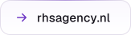

<!-- Every image below is generated: `pnpm build` for assets/, the profile workflow for the output branch. -->

<picture>
  <source media="(prefers-color-scheme: dark)" srcset="./assets/header-dark.svg">
  
</picture>

  <a href="https://www.rhsagency.nl"><picture><source media="(prefers-color-scheme: dark)" srcset="./assets/button-website-dark.svg"></picture></a>
  &nbsp;
  <a href="https://rhsui.com"><picture><source media="(prefers-color-scheme: dark)" srcset="./assets/button-rhs-ui-dark.svg"></picture></a>

<h3 align="center">About</h3>

<picture>
  <source media="(prefers-color-scheme: dark)" srcset="./assets/about-dark.svg">
  
</picture>

<h3 align="center">What I'm building</h3>

  <a href="https://rhsui.com"><picture><source media="(prefers-color-scheme: dark)" srcset="./assets/project-rhs-ui-dark.svg"></picture></a>
  <picture>
    <source media="(prefers-color-scheme: dark)" srcset="./assets/project-rhs-command-dark.svg">
    
  </picture>

  <a href="https://www.rhsagency.nl"><picture><source media="(prefers-color-scheme: dark)" srcset="./assets/project-rhs-agency-dark.svg"></picture></a>
  <picture>
    <source media="(prefers-color-scheme: dark)" srcset="./assets/project-client-work-dark.svg">
    
  </picture>

<h3 align="center">Stack</h3>

<picture>
  <source media="(prefers-color-scheme: dark)" srcset="./assets/stack-dark.svg">
  
</picture>

<h3 align="center">Activity</h3>

<picture>
  <source media="(prefers-color-scheme: dark)" srcset="https://raw.githubusercontent.com/rickvandehaar/rickvandehaar/output/activity-dark.svg">
  
</picture>

<picture>
  <source media="(prefers-color-scheme: dark)" srcset="https://raw.githubusercontent.com/rickvandehaar/rickvandehaar/output/snake-dark.svg">
  
</picture>

<picture>
  <source media="(prefers-color-scheme: dark)" srcset="./assets/footer-dark.svg">
  
</picture>
